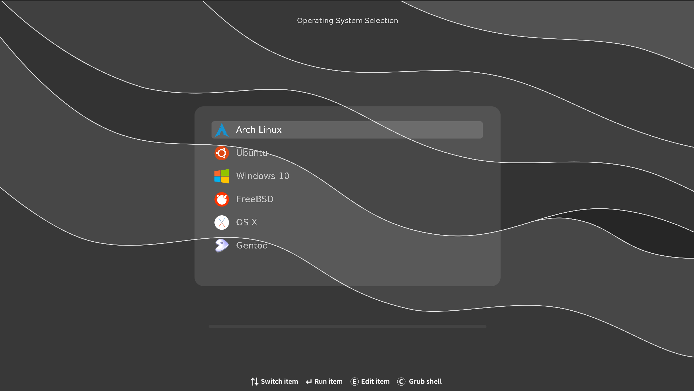

# grub-theme-obs

A highly customizable grub theme.



## Declarations
- backgrounds/wave.png is pulled from a grub theme `Graphite Grub2 theme`
- backgrounds/eso0925a.jpg is cropped from [a photo taken by NASA](https://images.nasa.gov)
- backgrounds/tri.png is generated from [a javascript project](https://github.com/mdgspace/trianglify)
- icons/* are pulled from [a grub theme "ubuntu-mate"](https://github.com/RobLoach/ubuntu-mate)
- terminal_boxes/* are pulled from [a grub theme "mate"](https://github.com/mateosss/matter)

## Install

### Using grub-customizer

Install grub-customizer and select this project, and save.

### Manual

To be done ...

### Install Script

To be done ...(perhaps other theme's install script is available?)

## Structure

```
grub-theme-obs
├── backgrounds
│   └── ..
├── icons
│   └── ..
├── terminal_boxes
│   └── ..
├── menus
│   ├── ..
│   └── viewbox.xcf
├── menu_selects
│   └── ..
├── misc
│   ├── ..
│   └── info.xcf
├── progress_bars
│   ├── ..
│   └── progressing_bar.inkscape.svg
├── *.pf2
└── theme.txt
```

## Customize

Read these first:

[Grub2 theme reference](http://wiki.rosalab.ru/en/index.php/Grub2_theme_/_reference)

[Grub2 theme tutorial](http://wiki.rosalab.ru/en/index.php/Grub2_theme_tutorial)

.xcf files can be edit with [GIMP](https://www.gimp.org)

.inkscape.svg can be edit with [inkscape](https://inkscape.org)